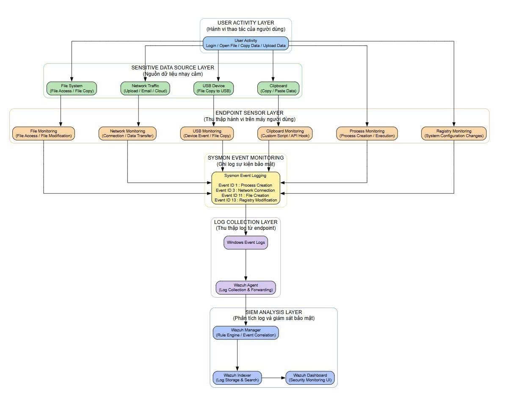

# 🛡️ Data Leakage Detection System (DLDS)

Dự án này là hệ thống giám sát và phát hiện rò rỉ dữ liệu nội bộ (DLP) dựa trên nền tảng **Wazuh SIEM**, **Sysmon** và **Python Detection Engine**. Dự án tập trung vào việc nhận diện sớm các hành vi truy cập trái phép, sao chép dữ liệu nhạy cảm ra thiết bị ngoại vi hoặc tải lên các nền tảng đám mây trái quy định.


## 🏗️ Kiến trúc Hệ thống

Hệ thống được thiết kế theo mô hình 4 lớp, đảm bảo khả năng giám sát tập trung và phản ứng tức thời:

* **Endpoint Layer**: Sử dụng Sysmon để thu thập các log chi tiết về tiến trình, mạng và tương tác Clipboard trên máy trạm Windows.
* **Security Monitoring Layer**: Wazuh Manager đóng vai trò tập trung log, xử lý sự kiện và cung cấp Dashboard giám sát.
* **Detection Layer**: Bộ não phân tích (Python Engine) thực hiện đối chiếu từ khóa nhạy cảm, mã băm (Hash) và tương quan hành vi.
* **Database Layer**: Lưu trữ cấu hình từ khóa, thông tin máy trạm và nhật ký cảnh báo (Alerts History).

---

## 🚀 Tính năng chính

* **Phát hiện rò rỉ đa kênh**: Giám sát hành vi copy dữ liệu qua USB, upload lên Cloud, Email, và các ứng dụng chat.
* **Giám sát Clipboard**: Ghi nhận nội dung người dùng sao chép (Copy/Paste) để ngăn chặn rò rỉ dữ liệu qua bộ nhớ tạm.
* **Cảnh báo thời gian thực**: Tích hợp Telegram Bot để gửi thông báo ngay lập tức khi phát hiện hành vi đáng ngờ.
* **Phân tích tương quan**: Engine không chỉ phát hiện từ khóa đơn lẻ mà còn dựa trên sự kết hợp hành vi (vd: mở file nhạy cảm + mở trình duyệt).

---

## 🛠 Tech Stack

| Thành phần | Công nghệ |
| :--- | :--- |
| **SIEM** | Wazuh Manager v4.x |
| **Endpoint Monitoring** | Sysmon, Wazuh Agent |
| **Detection Engine** | Python 3.x (Requests, Watchdog, Psutil) |
| **Database** | MySQL |
| **Notification** | Telegram Bot API |
| **Automation** | Bash Scripts, PowerShell |

---
<p align="center">
  
</p>
## 📂 Cấu trúc Dự án

```text
/
├── config/                  # Cấu hình hệ thống
│   ├── README.md            # Tài liệu cấu hình
│   ├── local_rules.xml      # Quy tắc phát hiện rò rỉ tùy chỉnh
│   ├── ossec.conf           # Cấu hình Wazuh Manager
│   └── sysmonconfig.xml     # Cấu hình Sysmon
├── database/                # Quản lý dữ liệu
│   ├── README.md            # Tài liệu Database
│   └── schema.sql           # Database schema
├── demo_assets/             # Hình ảnh & Video demo
│   └── DLP_System_Demo.md   # Tài liệu hướng dẫn Demo
├── detection-engine/        # Engine phân tích log
│   ├── README.md            # Tài liệu Engine
│   ├── detection.py         # Script giám sát chính
│   ├── keywords.txt         # Danh sách từ khóa mật
│   └── requirements.txt     # Thư viện phụ thuộc
├── docs/                    # Tài liệu dự án
│   └── Architecture.md      # Sơ đồ kiến trúc
├── reports/                 # Báo cáo dự án
│   └── FULL_TỔNG HỢP...     # Báo cáo luồng rò rỉ
├── scripts/                 # Công cụ tự động hóa
│   ├── README.md            # Tài liệu scripts
│   ├── clipboard.ps1        # Script giám sát Clipboard
│   └── install.sh           # Script cài đặt tự động
├── slides/                  # Slide thuyết trình
│   └── Silde_Link.md        # Link slide thuyết trình
├── .gitignore               # Cấu hình bỏ qua file
├── LICENSE                  # Giấy phép dự án
└── README.md                # Tài liệu tổng quan dự án
🔍 Tổng hợp 15 Luồng Rò rỉ Dữ liệu (DLP Scenarios)
Nhóm	STT	Kỹ thuật rò rỉ	Giải pháp ngăn chặn & Log
I. Con người	1-5	Email, Cloud cá nhân, Chụp ảnh, Ngụy trang, Chia nhỏ	Quét nội dung, Chặn copy, Watermark định danh
II. Thiết bị	6-9	USB, Keylogger, In ấn (Print to PDF), Cổng ngoại vi	Chặn USB lạ, Chống ghi đè bàn phím, DPI
III. Internet	10-12	Web chia sẻ, API Token, Ứng dụng Chat (Zalo/AI)	Kiểm soát Network DLP, Quản lý Scope API
IV. Kỹ thuật	13-15	Tunneling (DNS/ICMP), Máy ảo, File ẩn	Deep Packet Inspection, Chặn RDP Clipboard
(Chi tiết chi tiết từng kỹ thuật xem tại /docs/Architecture.md)

🛠 Hướng dẫn Triển khai nhanh
Cài đặt Engine:

Bash
cd scripts && sudo ./install.sh
Cấu hình: Cập nhật TELEGRAM_TOKEN và CHAT_ID vào file cấu hình hoặc biến môi trường.

Chạy giám sát:

Bash
python3 detection-engine/detection.py
🧹 Clean Up
Để ngắt kết nối và dừng giám sát:

Bash
# Dừng các process detection
pkill -f detection.py

# Xóa các file log tạm
rm /var/ossec/logs/dlp_alerts.log


Author: VanHung
